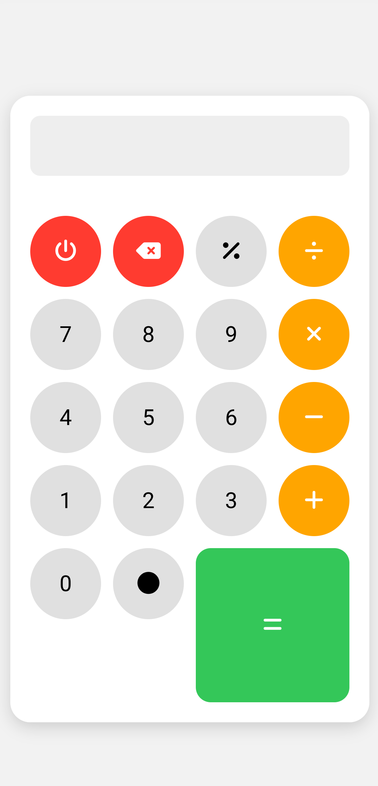

# 📱 Xiaomi Style Calculator (Basic)

A clean, responsive, and modern calculator web app styled like Xiaomi's MIUI calculator. Built with pure HTML, CSS, and JavaScript — no frameworks, no bloat.

> **Try it on your phone — it's mobile-first!**

---

## 🚀 Features

- 🧮 Basic arithmetic operations (`+`, `-`, `×`, `÷`, `%`)
- 📱 Mobile-first responsive design
- 🔋 Xiaomi MIUI-style UI
- 🧠 Real-time result preview
- 💾 PWA-ready (installable on Android/iOS)
- 🛠️ No frameworks, only vanilla HTML/CSS/JS

---

## 📸 Preview

 <!-- Add a screenshot image to your repo if you'd like -->

---

## 📦 Folder Structure

```
Calculator-Basic/
│
├── index.html          # Main calculator HTML
├── style.css           # Xiaomi-style responsive CSS
├── sw.js               # Service Worker for PWA support
├── manifest.json       # PWA manifest file
└── icon-192.png        # App icon (for mobile install)
```

---

## 🛠️ How to Use

1. Clone the repo:
   ```bash
   git clone https://github.com/Moneythepro/Calculator-Basic.git
   ```
2. Open `index.html` in any browser.
3. (Optional) Install as a PWA on mobile — it works offline!

---

## 📱 Add to Home Screen

- Open in mobile browser (like Chrome)
- Tap "Add to Home Screen" to install the calculator as an app

---

## 📋 License

This project is licensed under the [MIT License](LICENSE).

---

## 👤 Author

Built with ❤️ by [Moneythepro](https://github.com/Moneythepro)
